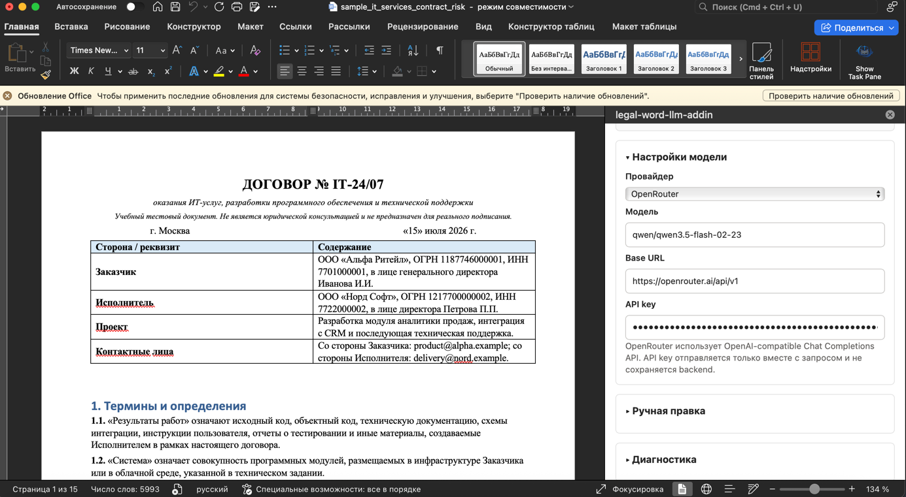
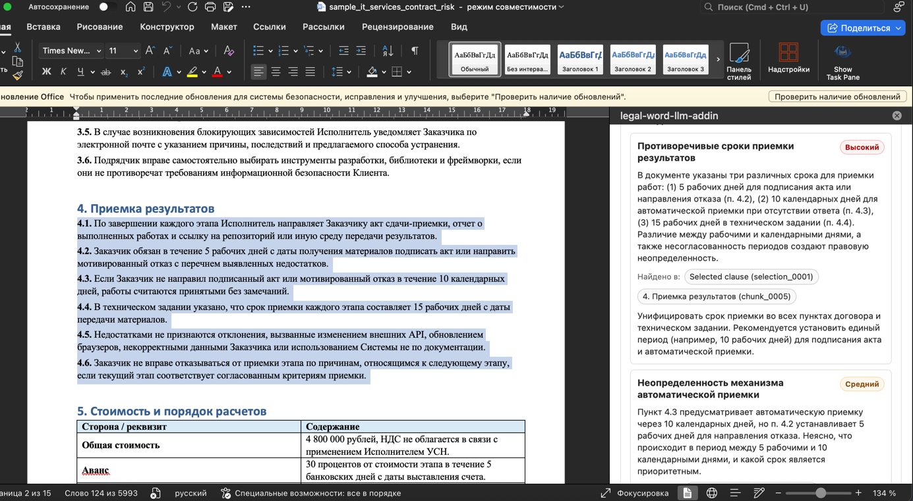
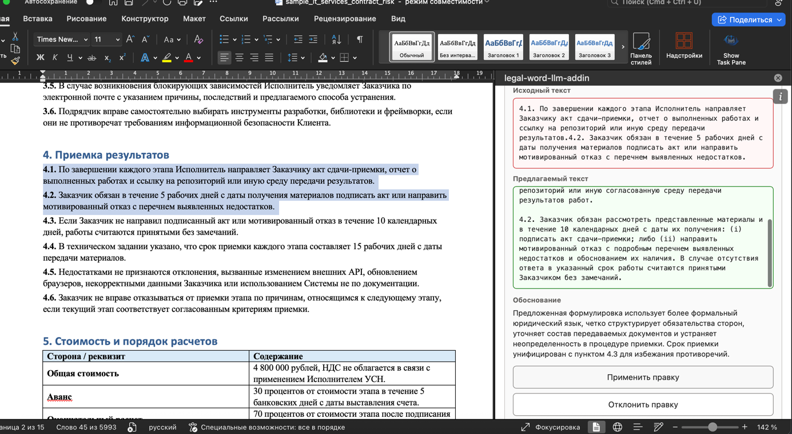
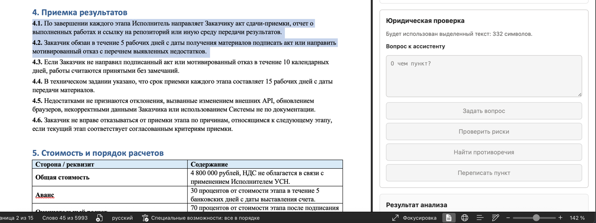
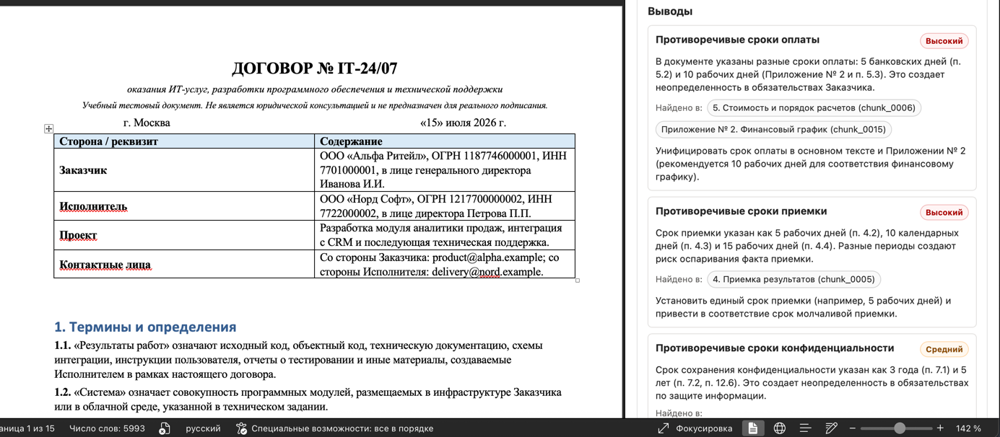

# Юридический LLM-ассистент для Microsoft Word

Word Task Pane Add-in для анализа и аккуратного редактирования юридических документов.

Проект состоит из двух частей:

```text
backend/   FastAPI API, provider layer, context layer и legal orchestration
frontend/  Word task pane на Vite + React + TypeScript + Office.js
```

Backend поддерживает `mock`, `openrouter` и `openai_compatible`. API key вводится пользователем
в интерфейсе надстройки, отправляется только в конкретном запросе и не хранится в `.env`,
frontend config или backend storage.

Проект не использует LangChain, LangGraph, базу данных, vector DB, embeddings или auth.

## Возможности

- чтение выделенного фрагмента из Word;
- чтение полного документа;
- режимы контекста: Auto, Selection, Full document, Smart context;
- вопросы к ассистенту по документу;
- проверка юридических рисков;
- поиск противоречий в документе;
- переписывание выделенного пункта;
- preview предложенной правки;
- Apply/Reject controlled editing: Word меняется только после нажатия `Применить правку`.

## Скриншоты











## Быстрый запуск

### Требования

- Python 3.11+
- Node.js 18+
- Microsoft Word desktop
- Git

Скачать проект:

```bash
git clone https://github.com/zachhew/legal-word-llm-addin.git
cd legal-word-llm-addin
```

### Backend

Самый простой запуск:

```bash
cd backend
./start.sh
```

Ручная установка и запуск:

```bash
cd backend
python3 -m venv --prompt backend .venv
.venv/bin/python -m pip install -e ".[dev]"
source .venv/bin/activate
uvicorn app.main:app --reload --port 8000
```

Backend будет доступен на:

```text
http://127.0.0.1:8000
```

Проверка:

```bash
curl http://127.0.0.1:8000/health
```

### Frontend / Word Add-in

Установите зависимости:

```bash
cd frontend
npm install
```

Один раз установите доверенные localhost-сертификаты Office:

```bash
cd frontend
npx office-addin-dev-certs install
```

Запустите Vite dev server:

```bash
cd frontend
npm run dev
```

В отдельном терминале выполните sideload в Word:

```bash
cd frontend
npm run sideload
```

Остановить sideload/debugging session:

```bash
cd frontend
npm run stop
```

Task pane открывается по адресу:

```text
https://localhost:3000/taskpane.html
```

## Команды frontend

```bash
cd frontend
npm run dev       # Vite dev server
npm run build     # production build в frontend/dist
npm run sideload  # sideload manifest.xml в Word
npm run stop      # остановить Office debugging session
npm run lint      # Office Add-in lint
npm run validate  # проверка manifest.xml через Microsoft validator
```

Frontend ходит в backend через Vite proxy `/backend`, который проксируется на
`http://127.0.0.1:8000`. Это нужно, чтобы Word WebView не блокировал HTTPS-to-HTTP mixed content.

Настроить backend target можно переменной:

```bash
BACKEND_PROXY_TARGET=http://127.0.0.1:8000 npm run dev
```

## Настройки провайдера

В интерфейсе доступны:

- `Mock` — локальные mock-ответы без API key;
- `OpenRouter` — OpenAI-compatible Chat Completions API через OpenRouter;
- `OpenAI-compatible` — любой совместимый endpoint.

По умолчанию выбран OpenRouter. API key вводится в UI и не сохраняется.

Frontend defaults находятся в:

```text
frontend/src/taskpane/config/appConfig.ts
```

Там нет и не должно быть API keys.

## Context Strategy

Auto mode выбирает контекст по сценарию:

- `Переписать пункт` использует выделенный пункт как основной контекст;
- `Проверить риски` использует выделение плюс связанные секции, если доступен полный документ;
- `Найти противоречия` использует section-aware chunking, low-level raw signals, LLM fact extraction и deterministic conflict candidates;
- `Задать вопрос` использует выделение, полный документ или smart retrieval в зависимости от доступного текста.

Regex используется только для низкоуровневых сигналов: сроки, проценты, суммы, даты и ссылки на
пункты. Семантические юридические факты извлекаются LLM через structured JSON prompt.

## Controlled Editing

Backend никогда не меняет Word-документ напрямую. Он возвращает `suggested_actions`.

Frontend показывает:

- исходный текст;
- предлагаемый текст;
- обоснование, если оно пришло от модели;
- кнопки `Применить правку` и `Отклонить правку`.

Перед Apply frontend проверяет, что текущее выделение в Word точно совпадает с `original_text`.
Если пользователь выделил другой фрагмент, правка не применяется.

## Sample Documents

Для ручной проверки есть документы:

```text
sample-documents/sample_it_services_contract_risk.docx
sample-documents/sample_saas_dpa_contract_inconsistencies.docx
```

Рекомендуемые сценарии:

1. Открыть `sample_it_services_contract_risk.docx`, выделить пункт об ответственности, нажать
   `Прочитать выделенный текст`, затем `Проверить риски`.
2. Открыть `sample_saas_dpa_contract_inconsistencies.docx`, нажать `Найти противоречия`.
3. Проверить, что предложенная правка не применяется до нажатия `Применить правку`.

## Backend Configuration

Backend читает optional config из `backend/.env`.

```bash
cp backend/.env.example backend/.env
```

В `.env` можно менять CORS origins, лимиты контекста, provider base URLs и timeout.
API keys туда добавлять не нужно.


## Ограничения

- Jobs для full-document inconsistency analysis хранятся in-memory и рассчитаны на локальный single-process backend.
- Качество fact extraction зависит от выбранной LLM-модели.
- Mock provider нужен для локальной демонстрации flow и не заменяет реальный legal analysis.
- Проект пока не содержит production auth, persistent storage и server-side secret management.
